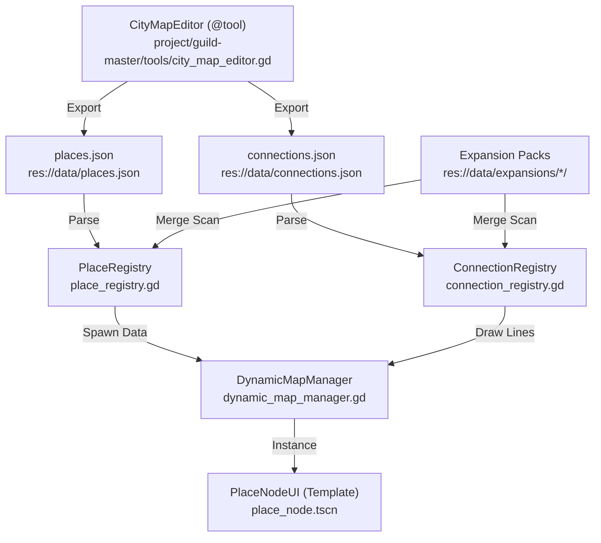

# 🗺️ City Map Editor (JSON + Coordinate Layout Hybrid) Implementation Plan

> **For agentic workers:** REQUIRED SUB-SKILL: Use superpowers:subagent-driven-development (recommended) or superpowers:executing-plans to implement this plan task-by-task. Steps use checkbox (`- [ ]`) syntax for tracking.

**Goal:** Build a Godot 4.x GUI-based City Map Editor (@tool node) and a Dynamic Map Manager that saves and loads places and connections as 100% data-driven JSON files, supporting modular, code-free expansions (like Dunwich/Innsmouth in Arkham Horror).

**Architecture:** Create a `@tool` script (`project/guild-master/tools/city_map_editor.gd`) that runs inside the Godot Editor, allowing drag-and-drop node placement and connection editing, exporting to unified `places.json` and `connections.json`. Develop a dynamic runtime map loader (`project/guild-master/scripts/systems/dynamic_map_manager.gd`) that parses these JSONs and procedural-renders the UI/connections at runtime, scanning expansion directories automatically.

**Tech Stack:** Godot 4.3 (GDScript), JSON format, Line2D (for dynamic connection lines).

---

## 🛠️ File Structure & Boundary Map



---

## 📋 Implementation Tasks

### Task 1: Registry Refactoring (Data-Driven Refactoring)

**Files:**
- Modify: `project/guild-master/scripts/systems/place_registry.gd`
- Create: `project/guild-master/scripts/systems/connection_registry.gd`
- Create: `project/guild-master/data/places.json`
- Create: `project/guild-master/data/connections.json`

- [ ] **Step 1: Create new unified places.json and connections.json templates**
  
  Create initial files under `project/guild-master/data/` as blueprints for editor exports.

  * `project/guild-master/data/places.json`:
  ```json
  {
    "places": [
      {
        "id": "fireside_amber",
        "name": "Fireside Amber",
        "display_name_kr": "불가사의한 루비 선술집",
        "tags": ["선술집 주인", "정보원", "데이트 가능", "치유"],
        "zone": "north_district",
        "coordinate": { "x": 450, "y": 200 },
        "base_npc": ["luise"],
        "description": "루이제가 운영하는 안락하고 비교적 안전한 선술집입니다."
      }
    ]
  }
  ```

  * `project/guild-master/data/connections.json`:
  ```json
  {
    "connections": [
      {
        "id": "conn_tavern_to_library",
        "from": "fireside_amber",
        "to": "grand_library",
        "name": "Tavern Library Path",
        "display_name_kr": "도서관 골목 대로",
        "movement_cost": 1,
        "encounter_chance": 0.15,
        "event_ids": ["evt_street_merchant"]
      }
    ]
  }
  ```

- [ ] **Step 2: Refactor PlaceRegistry to load the single places.json file**

  Modify `place_registry.gd` so it loads unified `places.json` at startup, parses the array into `_places` dictionary, and keeps fallback logic to load individual files if needed for backwards compatibility.

  ```gdscript
  # Modify res://scripts/systems/place_registry.gd
  const UNIFIED_PLACES_PATH := "res://data/places.json"
  
  func _load_all_places() -> void:
      # Try unified file first
      if FileAccess.file_exists(UNIFIED_PLACES_PATH):
          _load_unified_places()
      else:
          _load_legacy_places_dir()
  
  func _load_unified_places() -> void:
      var file := FileAccess.open(UNIFIED_PLACES_PATH, FileAccess.READ)
      if file == null:
          return
      var json := JSON.new()
      if json.parse(file.get_as_text()) == OK:
          var data: Dictionary = json.get_data()
          if data.has("places"):
              for place in data["places"]:
                  _places[place["id"]] = place
      file.close()
  ```

- [ ] **Step 3: Implement ConnectionRegistry**

  Create `connection_registry.gd` to load and serve connections between places.

  ```gdscript
  # Create res://scripts/systems/connection_registry.gd
  extends Node
  class_name ConnectionRegistry
  
  const PATH := "res://data/connections.json"
  var _connections: Dictionary = {} # conn_id -> data
  var _adjacency_list: Dictionary = {} # place_id -> Array of connections
  
  func _ready() -> void:
      load_connections()
  
  func load_connections() -> void:
      if not FileAccess.file_exists(PATH): return
      var file := FileAccess.open(PATH, FileAccess.READ)
      var json := JSON.new()
      if json.parse(file.get_as_text()) == OK:
          var data: Dictionary = json.get_data()
          if data.has("connections"):
              for conn in data["connections"]:
                  _connections[conn["id"]] = conn
                  _add_to_adjacency(conn["from"], conn)
                  _add_to_adjacency(conn["to"], conn)
  
  func _add_to_adjacency(place_id: String, conn: Dictionary) -> void:
      if not _adjacency_list.has(place_id):
          _adjacency_list[place_id] = []
      _adjacency_list[place_id].append(conn)
      
  func get_connections_for(place_id: String) -> Array:
      return _adjacency_list.get(place_id, [])
  ```

- [ ] **Step 4: Commit Registry Changes**

  Stage and commit changes.
  `git add project/guild-master/scripts/systems/place_registry.gd project/guild-master/scripts/systems/connection_registry.gd`
  `git commit -m "feat(registry): refactor PlaceRegistry and add ConnectionRegistry for unified JSON support"`

---

### Task 2: Godot Editor GUI Tool (City Map Editor)

**Files:**
- Create: `project/guild-master/tools/city_map_editor.gd`
- Create: `project/guild-master/tools/city_map_editor.tscn`

- [ ] **Step 1: Write @tool script for map visualization in the Godot Editor**

  Develop a drag-and-drop canvas editor in Godot that translates visual placement to Coordinates.

  ```gdscript
  # res://tools/city_map_editor.gd
  @tool
  extends Control
  class_name CityMapEditor
  
  @export var places_data_path := "res://data/places.json"
  @export var connections_data_path := "res://data/connections.json"
  
  # Editor UI References
  @onready var place_container: Control = $PlaceContainer
  @onready var line_container: Node2D = $LineContainer
  
  func _ready() -> void:
      if Engine.is_editor_hint():
          # Setup editor visualization
          load_from_json()
  
  func export_to_json() -> void:
      var places_array := []
      var connections_array := []
      
      # Loop through children nodes to record coordinates and metadata
      for child in place_container.get_children():
          if child is Button: # Or custom PlaceEditorNode
              var place_data = {
                  "id": child.name,
                  "name": child.text,
                  "display_name_kr": child.get_meta("display_name_kr", child.text),
                  "tags": child.get_meta("tags", []),
                  "zone": child.get_meta("zone", "north_district"),
                  "coordinate": { "x": child.position.x, "y": child.position.y },
                  "base_npc": child.get_meta("base_npc", []),
                  "description": child.get_meta("description", "")
              }
              places_array.append(place_data)
      
      # Write unified JSONs
      var p_file := FileAccess.open(places_data_path, FileAccess.WRITE)
      p_file.store_string(JSON.stringify({"places": places_array}, "\t"))
      p_file.close()
      print("Map exported successfully!")
  ```

- [ ] **Step 2: Setup visual node editor scene and export buttons**

  Build the `city_map_editor.tscn` containing a save/export trigger button and custom inspector scripts.

- [ ] **Step 3: Commit Editor Tool**

  `git add project/guild-master/tools/city_map_editor.gd`
  `git commit -m "feat(editor): implement Godot-native @tool CityMapEditor node with JSON export"`

---

### Task 3: Dynamic Map Manager (Runtime Loader)

**Files:**
- Create: `project/guild-master/scenes/ui/map/dynamic_map_manager.gd`
- Create: `project/guild-master/scenes/ui/map/place_node.tscn`
- Create: `project/guild-master/scenes/ui/map/place_node.gd`

- [ ] **Step 1: Create reusable PlaceNode UI template**

  Build a modular button widget that displays tags, handles clicks, and shifts color dynamically based on Local Crisis.

  ```gdscript
  # res://scenes/ui/map/place_node.gd
  extends Button
  class_name PlaceNodeUI
  
  var place_id: String
  var display_name: String
  var is_corrupted: bool = false
  
  func setup(data: Dictionary) -> void:
      place_id = data["id"]
      display_name = data.get("display_name_kr", data["name"])
      text = display_name
      position = Vector2(data["coordinate"]["x"], data["coordinate"]["y"])
      
  func set_crisis_state(state: String) -> void:
      if state == "Corrupted" or state == "Dungeon":
          is_corrupted = true
          modulate = Color.RED
      else:
          is_corrupted = false
          modulate = Color.WHITE
  ```

- [ ] **Step 2: Implement DynamicMapManager runtime parsing & drawing logic**

  Spawn places from `PlaceRegistry` and draw lines using `Line2D` nodes dynamically connecting the spawned places based on `ConnectionRegistry`.

  ```gdscript
  # res://scenes/ui/map/dynamic_map_manager.gd
  extends Control
  class_name DynamicMapManager
  
  @export var place_node_scene: PackedScene
  @onready var lines_parent: Node2D = $Lines
  @onready var places_parent: Control = $Places
  
  func _ready() -> void:
      build_map_at_runtime()
  
  func build_map_at_runtime() -> void:
      # 1. Clear previous instances
      for child in places_parent.get_children(): child.queue_free()
      for child in lines_parent.get_children(): child.queue_free()
      
      # 2. Spawn Place buttons
      var spawned_nodes: Dictionary = {}
      for place_id in PlaceRegistry._places:
          var place_data = PlaceRegistry.get_place(place_id)
          var node: PlaceNodeUI = place_node_scene.instantiate()
          places_parent.add_child(node)
          node.setup(place_data)
          spawned_nodes[place_id] = node
          
      # 3. Draw connections
      for conn_id in ConnectionRegistry._connections:
          var conn = ConnectionRegistry._connections[conn_id]
          var from_node = spawned_nodes.get(conn["from"])
          var to_node = spawned_nodes.get(conn["to"])
          if from_node and to_node:
              var line := Line2D.new()
              line.width = 3.0
              line.default_color = Color.GRAY
              line.add_point(from_node.position + from_node.size / 2)
              line.add_point(to_node.position + to_node.size / 2)
              lines_parent.add_child(line)
  ```

- [ ] **Step 3: Commit Map Manager**

  `git add project/guild-master/scenes/ui/map/`
  `git commit -m "feat(ui): implement dynamic runtime map manager and procedural connection drawing"`

---

### Task 4: Modular Expansion Scanner (The Board Expansion System)

**Files:**
- Modify: `project/guild-master/scripts/systems/place_registry.gd`
- Modify: `project/guild-master/scripts/systems/connection_registry.gd`

- [ ] **Step 1: Scan custom directories for expansion packs**

  Add modular folder scanning to both registries. Scanning `res://data/expansions/*/` dynamically appends/overrides current arrays.

  ```gdscript
  # Inside res://scripts/systems/place_registry.gd
  const EXPANSIONS_DIR := "res://data/expansions/"
  
  func load_expansions() -> void:
      var dir := DirAccess.open(EXPANSIONS_DIR)
      if dir == null: return # No expansions directory
      
      dir.list_dir_begin()
      var sub_dir_name := dir.get_next()
      while sub_dir_name != "":
          if dir.current_is_dir() and not sub_dir_name.starts_with("."):
              var exp_places_path = EXPANSIONS_DIR + sub_dir_name + "/places.json"
              if FileAccess.file_exists(exp_places_path):
                  _load_unified_places_file(exp_places_path)
          sub_dir_name = dir.get_next()
      dir.list_dir_end()
  ```

- [ ] **Step 2: Commit Expansion Logic**

  `git add project/guild-master/scripts/systems/place_registry.gd project/guild-master/scripts/systems/connection_registry.gd`
  `git commit -m "feat(expansion): add automatic scanning and merging of expansion pack JSONs"`

---

## 🧪 Verification Plan

### Automated Test Script (Headless CLI Verification)
- Create verification script: `project/guild-master/tools/verify_map_data.gd`
- This script runs headlessly via Godot command line to verify data parsing and registry stitch sanity:

```gdscript
# res://tools/verify_map_data.gd
extends SceneTree

func _init() -> void:
    print("----- RUNNING DYNAMIC MAP SYSTEM INTEGRITY CHECK -----")
    var place_reg = load("res://scripts/systems/place_registry.gd").new()
    var conn_reg = load("res://scripts/systems/connection_registry.gd").new()
    
    # Trigger loading manually in headless script
    place_reg._load_all_places()
    conn_reg.load_connections()
    
    # Assertions
    assert(place_reg._places.size() > 0, "ERROR: No places parsed!")
    assert(conn_reg._connections.size() > 0, "ERROR: No connections parsed!")
    
    # Integrity Check: Ensure connection 'from' and 'to' places exist in PlaceRegistry
    for conn_id in conn_reg._connections:
        var conn = conn_reg._connections[conn_id]
        assert(place_reg.has_place(conn["from"]), "ERROR: Connection " + conn_id + " points to non-existent place " + conn["from"])
        assert(place_reg.has_place(conn["to"]), "ERROR: Connection " + conn_id + " points to non-existent place " + conn["to"])
        
    print("SUCCESS: Dynamic Map registries matched perfectly with zero orphan nodes!")
    quit(0)
```

Run CLI Command:
`godot --headless -s project/guild-master/tools/verify_map_data.gd`
Expected output:
`SUCCESS: Dynamic Map registries matched perfectly with zero orphan nodes!`
