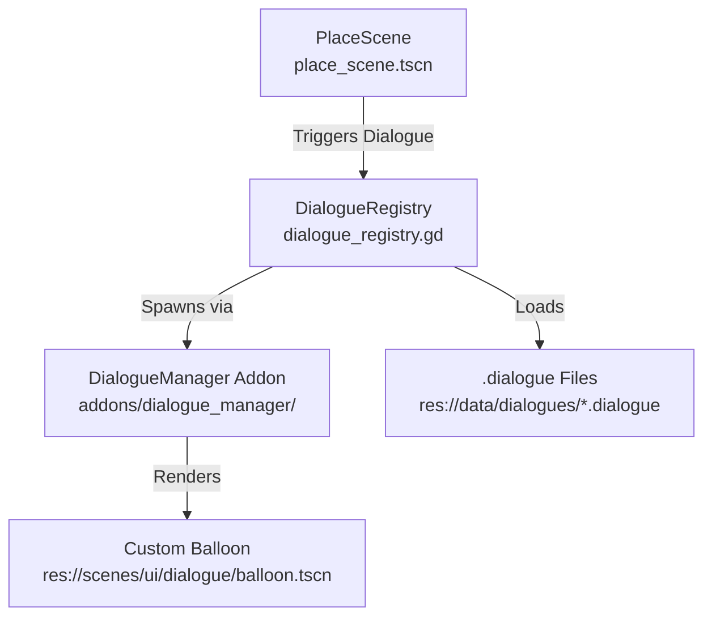

# 💬 Dialogue Manager Migration & Custom Balloon Resurrection Plan

> **For agentic workers:** REQUIRED SUB-SKILL: Use superpowers:subagent-driven-development (recommended) or superpowers:executing-plans to implement this plan task-by-task. Steps use checkbox (`- [ ]`) syntax for tracking.

**Goal:** Restore the Godot Dialogue Manager addon, migrate and resurrect the advanced custom visual novel balloon (supporting SCGs, typing effects, and custom sounds), remove the deprecated Ink integration, and align all dialogue registry logic and guides.

**Architecture:** Resurrect `addons/dialogue_manager` and original `.dialogue` files from Git history. Remove `addons/inkgd`. Relocate and refactor the custom balloon scene (`balloon.tscn`, `balloon.gd`) to `res://scenes/ui/dialogue/`. Refactor DialogueRegistry to parse native `.dialogue` resources. Rewrite the wiki guide to document `.dialogue` specifications.

---

## 🛠️ File Structure & Boundary Map



---

## 📋 Implementation Tasks

### Task 1: Addon Swap & Legacy File Restoration

**Files:**
- Restore: `project/guild-master/addons/dialogue_manager/`
- Restore: `project/guild-master/data/dialogues/*.dialogue`
- Delete: `project/guild-master/addons/inkgd/`

- [ ] **Step 1: Verify resurrected Dialogue Manager and dialogue files**

  Ensure that all `addons/dialogue_manager` and `.dialogue` source files have been fully checked out from Git history and exist on disk.

- [ ] **Step 2: Remove the deprecated inkgd addon folder**

  Delete `project/guild-master/addons/inkgd/` folder to clean up the codebase and prevent double-registry conflicts.

- [ ] **Step 3: Commit Task 1 Changes**

  `git add project/guild-master/addons/dialogue_manager project/guild-master/data/dialogues/*.dialogue`
  `git rm -r project/guild-master/addons/inkgd`
  `git commit -m "feat(pivot): swap inkgd with dialogue_manager addon and restore dialogue files"`

---

### Task 2: Custom Balloon Relocation & Refactoring

**Files:**
- Create: `project/guild-master/scenes/ui/dialogue/balloon.tscn`
- Create: `project/guild-master/scenes/ui/dialogue/balloon.gd`
- Create: `project/guild-master/scenes/ui/dialogue/balloon_animation_player.gd`
- Remove: `project/guild-master/Story/Dialogues-samples/custom_balloon/` (Legacy location)

- [ ] **Step 1: Move custom balloon files to their official UI folder**

  Move `balloon.tscn`, `balloon.gd`, and `balloon_animation_player.gd` from `Story/Dialogues-samples/custom_balloon/` to `scenes/ui/dialogue/`.

- [ ] **Step 2: Update internal script and texture references in balloon.tscn**

  Edit `balloon.tscn` in `scenes/ui/dialogue/` and update any external resource paths (such as scripts and sprites) to point to their relocated absolute paths:
  - Replace `res://Story/Dialogues/custom_balloon/balloon.gd` with `res://scenes/ui/dialogue/balloon.gd`
  - Replace `res://Story/Dialogues/custom_balloon/balloon_animation_player.gd` with `res://scenes/ui/dialogue/balloon_animation_player.gd`
  - Replace `res://Story/Dialogues/custom_balloon/assets/...` references with the correct assets paths.

- [ ] **Step 3: Update resource loading and balloon.gd logic**

  Ensure that the custom balloon script perfectly loads its assets, handles `FF_SPEED`, character labels, typewriting indicators, and binds seamlessly to the `DialogueManager` singleton.

- [ ] **Step 4: Commit Balloon Relocation**

  `git add project/guild-master/scenes/ui/dialogue/`
  `git commit -m "feat(ui): relocate and refactor custom VN balloon to scenes/ui/dialogue"`

---

### Task 3: DialogueRegistry Refactoring

**Files:**
- Modify: `project/guild-master/scripts/systems/dialogue_registry.gd` (or equivalent)

- [ ] **Step 1: Locate DialogueRegistry**

  Check if `dialogue_registry.gd` exists or where dialogue loading logic is situated. Refactor the script to register and pre-cache `.dialogue` resource files instead of `.ink.json`.

- [ ] **Step 2: Bind ActionRunner & Dialogue Manager**

  Make sure that Dialogue Manager mutations natively call `ActionRunner.run(...)` or `MetricStore` directly inside GDScript without complex external function declarations, maximizing the data-driven capabilities of dialogue scripts.

- [ ] **Step 3: Commit DialogueRegistry Changes**

  `git commit -am "feat(system): refactor DialogueRegistry to natively load .dialogue files"`

---

### Task 4: Guide Revision & Wiki Sanitization

**Files:**
- Delete: `wiki/01_시스템/ink_guide.md`
- Create: `wiki/01_시스템/dialogue_manager_guide.md`

- [ ] **Step 1: Write dialogue_manager_guide.md**

  Write a comprehensive user-facing guide detailing `.dialogue` syntax, Custom Balloon integration, and GDScript-native action triggers.

- [ ] **Step 2: Commit Documentation Changes**

  `git add wiki/`
  `git commit -m "docs(pivot): replace ink_guide.md with dialogue_manager_guide.md"`

---

## 🧪 Verification Plan

### CLI Integration Test
- Create custom validation script: `project/guild-master/tools/verify_dialogue_manager.gd`
- Boot Godot headlessly and assert:
  - `DialogueManager` addon can be successfully parsed.
  - Custom `balloon.tscn` can be loaded and instantiated without resource reference errors.
  - Re-restored `.dialogue` files are valid resources.

Command:
```powershell
godot --headless -s project/guild-master/tools/verify_dialogue_manager.gd
```
Expected output:
`SUCCESS: Godot Dialogue Manager addon and Custom Balloon loaded perfectly with zero errors!`
